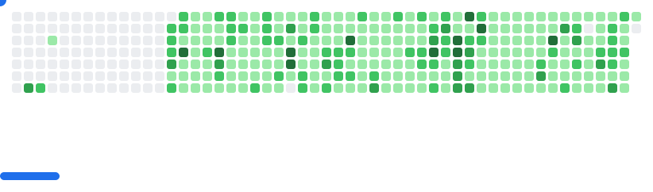

<!-- -->

 

    <h1 align="center">✩&emsp;Kblack&emsp;✩</h1>

 

  

<!--
<picture>
  <source media="(prefers-color-scheme: dark)" srcset="https://github.com/khoa083/khoa083/blob/output/github-contribution-grid-snake-dark.svg" />
  <source media="(prefers-color-scheme: light)" srcset="https://github.com/khoa083/khoa083/blob/output/github-contribution-grid-snake.svg" />
  
</picture>
-->
<picture>
  <source
    media="(prefers-color-scheme: dark)"
    srcset="images/breakout-dark.svg"
  />
  <source
    media="(prefers-color-scheme: light)"
    srcset="images/breakout-light.svg"
  />
  
</picture>

<!-- -->
